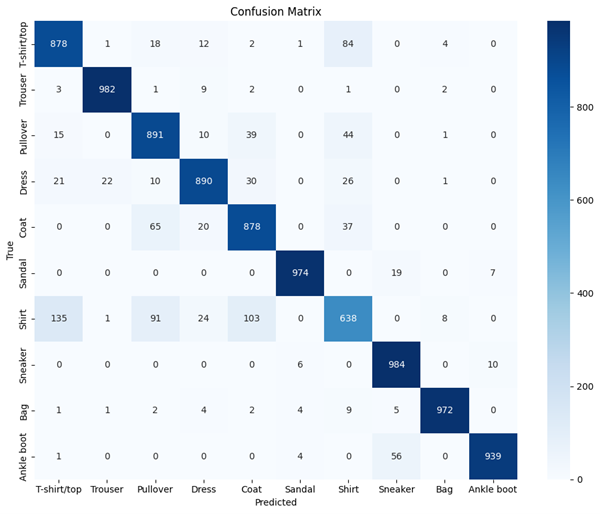
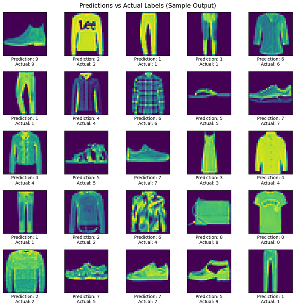

# Fashion-MNIST Image Classification using CNN

## Project Overview
This project implements a Convolutional Neural Network (CNN) to classify grayscale images from the Fashion-MNIST dataset into 10 clothing categories. The goal is to demonstrate an end-to-end deep learning workflow including preprocessing, model development, training, and evaluation using a standard benchmark dataset.

---

## Dataset
- **Dataset:** Fashion-MNIST  
- **Source:** `keras.datasets.fashion_mnist`  
- **Image size:** 28 × 28 (grayscale)  
- **Classes (10):** T-shirt/top, Trouser, Pullover, Dress, Coat, Sandal, Shirt, Sneaker, Bag, Ankle boot

---

## Methodology

### Data Preparation
- Normalized pixel values to [0, 1]
- Reshaped images to (28, 28, 1)for CNN input

### Model Architecture
- Convolutional layers for feature extraction  
- Max pooling layers for spatial reduction  
- Dropout for regularization  
- Dense layers with a softmax output for multi-class classification  

### Training Configuration
- Optimizer:Adam  
- Loss: Sparse Categorical Cross-Entropy  
- Metric: Accuracy  

---

## Model Evaluation

### Performance Summary
- **Test Accuracy:** ~90%
- Strong performance on visually distinct categories (e.g., Trouser, Sneaker, Bag, Ankle boot)
- Most errors occur between visually similar classes (e.g., Shirt vs T-shirt/top)

### Confusion Matrix
The confusion matrix shows class-level performance and highlights where misclassifications occur between similar clothing categories.

### Sample Predictions
Example predictions (including correct and incorrect cases) provide qualitative insight into model behavior and remaining ambiguity in visually similar items.

---

## Key Findings
- CNNs are effective for structured image classification tasks such as Fashion-MNIST.
- Normalization and dropout improve generalization.
- Misclassifications are mainly driven by visual similarity between certain categories rather than overall model instability.
- Achieved performance is consistent with typical CNN results on Fashion-MNIST.

---

## Note

This project was developed as part of my Master of Data Science program, within the
Predictive Analytics for Business course.

## Contact
For any questions, please contact me:

- [LinkedIn](https://www.linkedin.com/in/mashael-alsogair-97b754230/)

Thank you!
